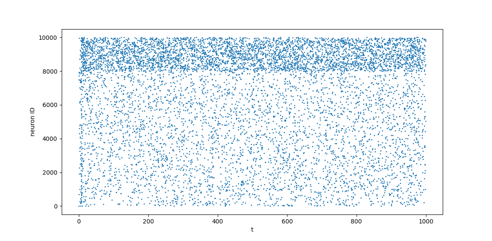

# morphyne
An accelerated spiking neural network simulator for neurmorphic computing and research in Python. Suitable for large-scale simulations. Achieves up to 100 million synaptic transmissions (including STP and R-STDP) per second on a desktop computer. Its [core engine](https://github.com/ssgier/morphine) is event-driven, parallel and written in Rust.

## Features
* LIF (leaky integrate-and-fire) neurons with optionally adaptive threshold
* Axonal conduction delays
* Short term plasticity (STP)
* Reward-modulated spike-timing-dependent plasticity (R-STDP) with a short term (decaying) and long term variant
* Parametrization options: JSON, YAML, Python Dictionary
* Pandas-based user interface

## Project State
Complete in functionality but lacks user documentation. I am currently using it for my own research and experiments. I plan to write documentation at some point, perhaps in form of a Jupyter notebook. If you are interested in trying this tool out, please message me on LinkedIn or create an issue.

## Basic Demo
Install it:
```
pip install morphyne
```

Run example:
```
import morphyne as mp
import pandas as pd
import matplotlib.pyplot as plt
import json

params = mp.get_example_params()
print(json.dumps(params, indent=4))

instance = mp.create(params)
instance.set_non_coherent_stimulation_rate(0.0005)
instance.set_reward_rate(0.1)

stimulus_df = pd.DataFrame({"t": [0, 5, 10], "in_channel_id": [0, 1, 2]})
stimulus = mp.create_stimulus(in_channel_spikes=stimulus_df)

instance.apply_stimulus(stimulus)
tick_result = instance.tick_until(1000)

plt.scatter(tick_result.neuron_spikes.t, tick_result.neuron_spikes.nid, s=1)
plt.xlabel("t")
plt.ylabel("neuron ID")
plt.show()
```
Output Spike Raster:

